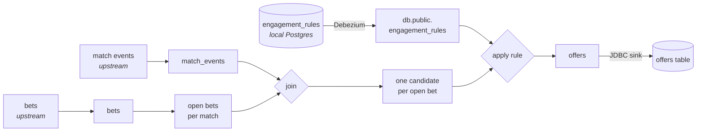

# live-bet-engagement

[](https://github.com/Kotryos/live-bet-engagement/actions)

A player has money on a match. A goal goes in. **Which players should hear about it,
and what should they be offered?**

That is the whole problem. It has to be answered while the match is still running,
for every player at once, and the marketing rules that decide it change during the
day.

---

## The idea

Three inputs feed the answer, and they arrive in two different ways.

**Bets and match events come from upstream systems.** This service does not own
that data. It is already published as event streams, so the pipeline simply reads
it.

**The engagement rules are local.** They live in this service's own Postgres table
and are edited by hand. So the table is captured with Debezium: someone runs an
`UPDATE`, and the running pipeline changes what it does about a second later.
Nothing restarts.

That split is the point of the project: **change data capture for data the service
owns, plain consumption for data published elsewhere.**

---

## How it works



A goal on a match with six open bets becomes six candidates. Each is checked against
the rule for that event type. What survives is an offer, written back to Postgres.

The app keeps a running list of open bets for every match. A bet is added when it is
placed and removed when it is settled, so that list cannot grow forever.

---

## Why there is no windowed join

The obvious design joins bets to match events in a time window. It does not work.
People place bets hours or days before kickoff, so any window wide enough to catch
them is useless.

Keeping open bets in a table instead is the right shape. The cost is that the table
grows, which is why settled bets are removed from it.

---

## Run it

```bash
./scripts/up.sh
```

That starts everything, creates both connectors and launches the app. Takes about a
minute and a half from cold. Then feed it:

```bash
java -cp app/build/libs/app-all.jar dev.kotryos.betengagement.feeder.Feeder bets data/bets.csv
```

```bash
java -cp app/build/libs/app-all.jar dev.kotryos.betengagement.feeder.Feeder match_events data/match-events.csv 4000
```

Bets first. A goal on a match with no bets yet produces nothing, which looks like a
bug and is not one.

See what came out:

```bash
docker exec postgres psql -U postgres -d engagement -c "SELECT * FROM offers;"
```

Watch it think:

```bash
docker compose logs -f app
```

Topics, schemas and connectors are all browsable at http://localhost:8080.

---

## See it react

**Change a rule while it runs.** In one window, watch the logs. In another:

```bash
docker exec postgres psql -U postgres -d engagement -c "UPDATE engagement_rules SET active = false WHERE event_type = 'GOAL';"
```

Offers for goals stop within a second. Set it back to `true` and they resume. Raise
`min_stake` to 55 and most of them disappear.

**Delete a rule.** Debezium sends a tombstone, the row vanishes from the app's
table, and that event type stops producing anything.

```bash
docker exec postgres psql -U postgres -d engagement -c "DELETE FROM engagement_rules WHERE event_type = 'RED_CARD';"
```

**Settle some bets.** Those players stop getting offers, and the open-bets list
shrinks.

```bash
java -cp app/build/libs/app-all.jar dev.kotryos.betengagement.feeder.Feeder bets data/settlements.csv
```

**Add three instances and watch them share the work.**

```bash
docker compose --profile full up -d --scale app=3
```

The logs show `RUNNING -> REBALANCING -> RUNNING`. The partitions split three ways,
and the new instances rebuild their share of the open-bets list from Kafka before
they process anything. Kill one and the survivors take over.

---

## Test it

```bash
./gradlew :app:test
```

Five tests, no Docker needed. They run the real topology in memory with a fake
schema registry. Two of them matter most: one proves an inactive rule stops all
offers, and one proves that changing a rule changes the result of the very next
event. Together they show the rules are a live feed, not something read once at
startup.

---

## What is where

```
data/           the CSV files the feeder reads
connectors/     the two Kafka Connect configs
postgres/init/  the database schema
app/            one Gradle module
  feeder/       reads a CSV, writes to Kafka
  streams/      the topology and the app that runs it
```

Built with Java 21, Kafka Streams, Debezium, Avro and Schema Registry, on Kafka
3.6 / Confluent 7.6.

Nothing keeps a Docker volume, so `docker compose down` throws everything away and
`./scripts/up.sh` builds it again.
